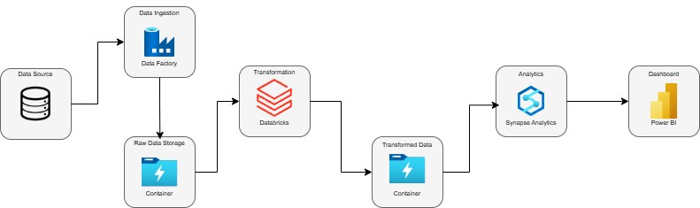
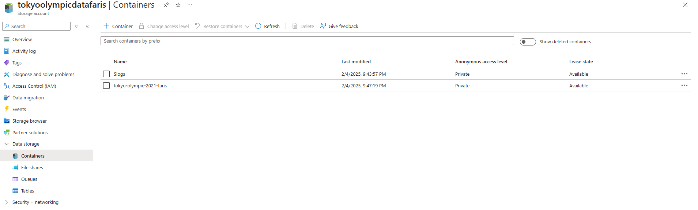
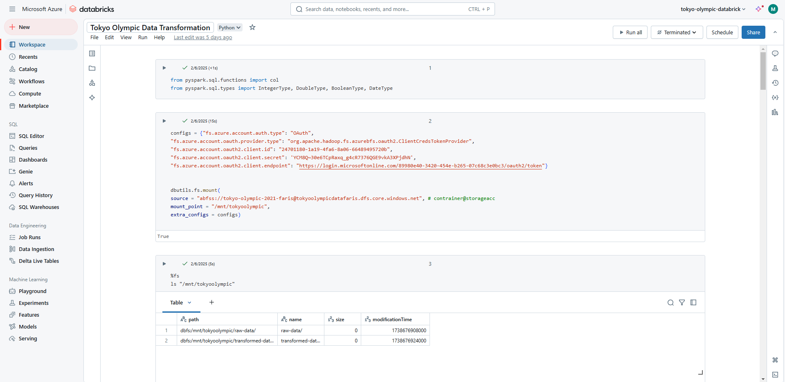
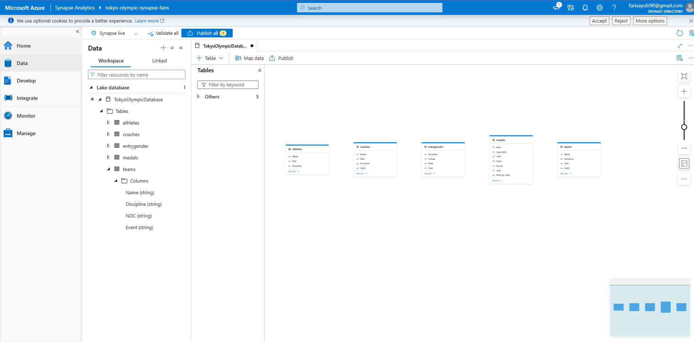
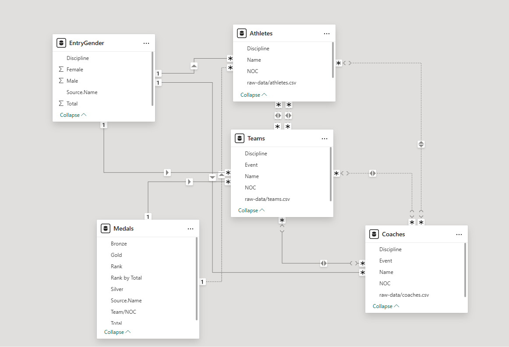
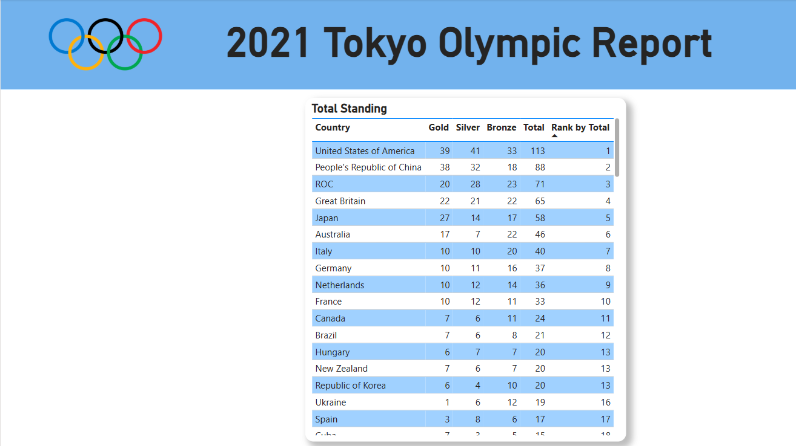
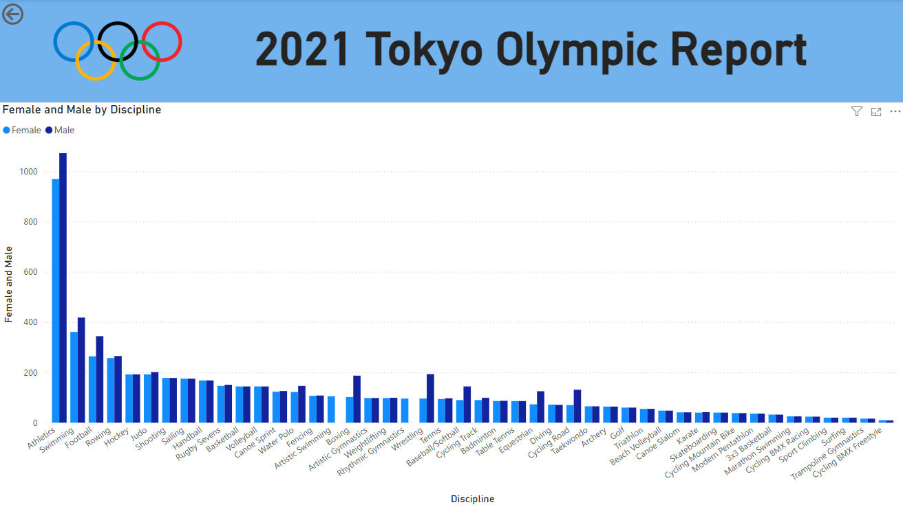
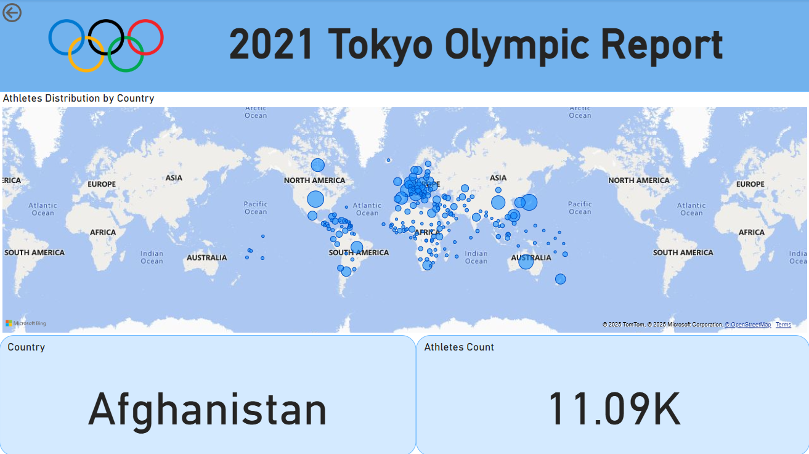
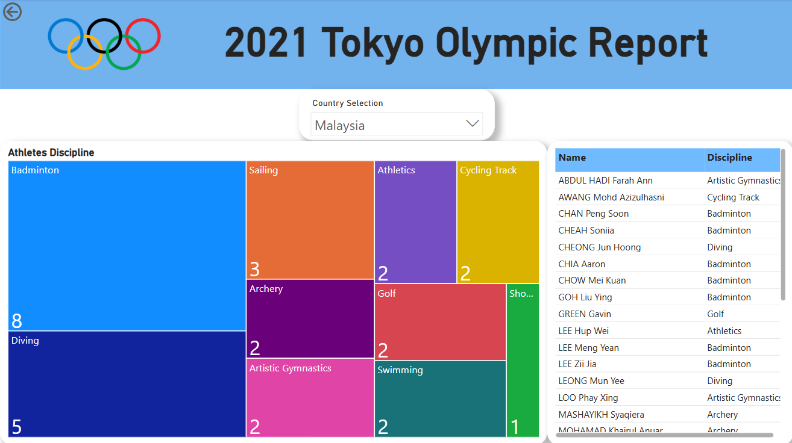

# Data Engineering with Microsoft Azure Service

## Introduction
In this project I have learned to use and understand the basic of Microsoft Azure Cloud Services. I am able to do basic data engineering using Microsoft Azure Services by using Storage Account, Data Factory (V2), Azure Databricks, Synapse workspace and Microsoft Power BI.

## Data Architecture

Data architecture basis from this project is raw data are ingest into Data Factory using copy data function that use HTTP-linked service to copy data from Github raw file to Azure Data Factory.

Data from Azure Data Factory is sink to Data Lake Storage Container after validation is done.

Then we mount the data from the Data Lake Storage Container to Azure Databricks.
`%fs
ls "/mnt/tokyoolympic"`

Then we can transform the data to make sure all the format is correct.
`athletes = spark.read.format("csv").option("header","true").option("inferSchema","true").load("/mnt/tokyoolympic/raw-data/athletes.csv")`

Then we can load back the transformed data to our Data Lake Storage Container.
`athletes.repartition(1).write.mode("overwrite").option("header",'true').csv("/mnt/tokyoolympic/transformed-data/athletes")`

Then we take the transformed data from the container to Synapse Analytics. We can setup a Lake database. Then, the data from Data Lake Storage Container is exported to Synapse Analytics. SQL analysis can be done inside Synapse Analytics.

Then we can export the data from Azure Blob Storage to PowerBI.

## Tools Used
Among the technology used for this project are as follows:
- Programming Languages:
  1. Python
  2. Pyspark
  3. SQL

- Microsoft Azure Services:
  1. Storage Account
     
  2. Data Factory (V2)
  3. Azure Databricks
     
  4. Synapse Analytics
     
  5. Power BI

## Dataset Used
Tokyo Olympics data contains dataset the details of the Athletes, Coaches, Teams participating as well as the Entries by Gender. The dataset contains athletes names, countries represented, sport discipline, gender of event and coaches name.

Link for the dataset : https://www.kaggle.com/datasets/arjunprasadsarkhel/2021-olympics-in-tokyo

## Data Model

Data Model from Power BI

## Power BI Dashboard
To review my dashboard from this project can just review : https://github.com/yeopster/Data-Engineering-Azure/blob/main/Tokyo%20Olympic%20Summary.pdf

Page Highlight:
1. To show overall standing of Country that participate in the Tokyo Olympics.
   
2. To give insight the difference between male and female participant by discipline.
   
3. To give insight on how much participant from each country.
   
4. To give insight of breakdown of discipline of sport by Country and athletes that participate in that discipline.
   

  

